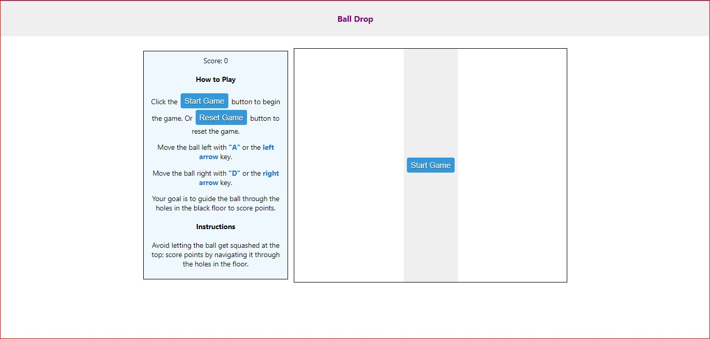

#

## Link to Project description

Project instruction

Redux Saga Intro (538)
For raw project instructions see: <http://syllabus.africacode.net/projects/redux-saga-intro/>

## drop-ball game

[](https://youtu.be/xr_0pU3aE1Y)

## A simple ball drop game built using react

## Motivation

This game involves a ball moving inside a box. If the ball falls in the black floor hole then the score is increased.

If the ball collides with the top boundary of the box, then the game is over. "Avoid getting squashed 😬"

## Features

- Move the ball with keys `a` and `d`.
- Dynamic increase in score and when the ball goes through a hole.

## Libraries

- UI Library: React
- State Management: Redux
- State Management Middlewares: Redux-saga

## How to Start

Follow these steps to set up and run the project:

1.**Install dependencies:**

```bash
   npm install
```

2.**Server to run game:**

```bash
   npm start
```

## Video game play link


## You can reach out 😀

[](mailto:sibusiso.mdlovu@umuzi.org)
[](https://github.com/Sibusiso-M/)
